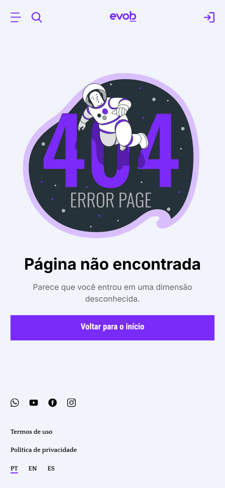

<a id="readme-top"></a>

# Evob - Frontend Teste

<br />
<div align="center">
  <a href="https://github.com/bruno167/Frontend-teste-2025/tree/main">
    <Image src="./public/EvobHome.png" alt="Home Page Evob" width="100%" height="100%">
  </a>

[](https://github.com/bruno167)

  <h3 align="center">Evob Plataforma de Cursos Online</h3>

  <p align="center">
    <a href="https://frontend-teste-2025.vercel.app/">Ver Demo</a>
  </p>
  <p align="center">
    <a href="https://www.youtube.com/watch?v=9ArTBsnmWaw&ab_channel=Bruno">Ver Video</a>
  </p>
</div>

---

## 📋 Sobre o Projeto

<div align="center">
    
    
    
</div>

Esse projeto faz parte do Teste de Front-End da **`Evob`** e se trata de uma plataforma de cursos online onde os usuários podem adicionar e remover cursos de uma lista personalizada de favoritos. Utilizando o `localStorage`, os cursos favoritos permanecem salvos mesmo após o navegador ser fechado. Desenvolvida com **Next.js** e **Styled-Components**, a interface é intuitiva e funcional, .

<p align="right">(<a href="#readme-top">voltar ao topo</a>)</p>

## 🛠️ Tecnologias Utilizadas

O projeto foi construído com as seguintes tecnologias:

[](https://nextjs.org/)  
[](https://www.typescriptlang.org/)  
[](https://reactjs.org/)  
[](https://styled-components.com/)  
[](https://axios-http.com/)  
[](https://eslint.org/)  
[](https://prettier.io/)  
[](https://github.com/cure53/DOMPurify)

<p align="right">(<a href="#readme-top">voltar ao topo</a>)</p>

---

## 🚀 Como Rodar Localmente

### Pré-requisitos

- Node.js
- NPM ou Yarn

### Instalação

1. Clone o repositório:

   ```bash
   git clone https://github.com/bruno167/Frontend-teste-2025
   cd evob

   ```

2. Instale as dependências:

   ```bash
   npm install
   # ou
   yarn install
   ```

3. Execute o servidor de desenvolvimento:

   ```bash
   npm run dev
   # ou
   yarn dev
   ```

4. Acesse `http://localhost:3000` no seu navegador.

<p align="right">(<a href="#readme-top">voltar ao topo</a>)</p>

## ✅ Funcionalidades

- [x] Listagem de dados via API
- [x] Responsividade
- [x] Consumo com Axios
- [x] Tipagem com TypeScript

<p align="right">(<a href="#readme-top">voltar ao topo</a>)</p>

## 🙋‍♂️ Contato

Bruno Teixeira – [LinkedIn](https://www.linkedin.com/in/brunodeveloper) – brunoa0504@gmail.com

[Link do Projeto](https://frontend-teste-2025.vercel.app/)

<p align="right">(<a href="#readme-top">voltar ao topo</a>)</p>
